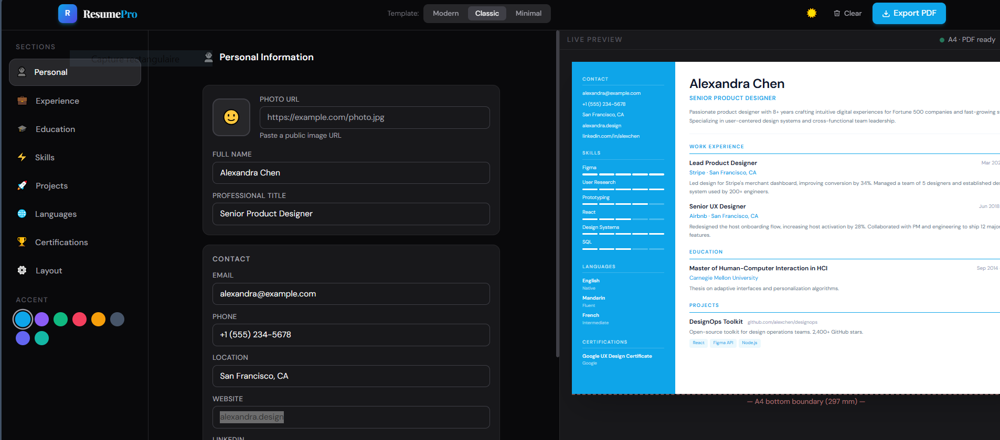

# Resume (CV) Builder Pro
<p align="center">
  
</p>
Create professional resumes with live preview and single-page PDF export.  
Built with React.

## Features
- Dynamic CV/Resume form
- Live preview
- Single-page PDF export
- Responsive layout

## Usage
1. Clone the repository:
   ```bash
   git clone https://github.com/elmaatouquii/resume-builder-pro.git
   
## Install dependencies:

npm install

## Start the app:

npm start
